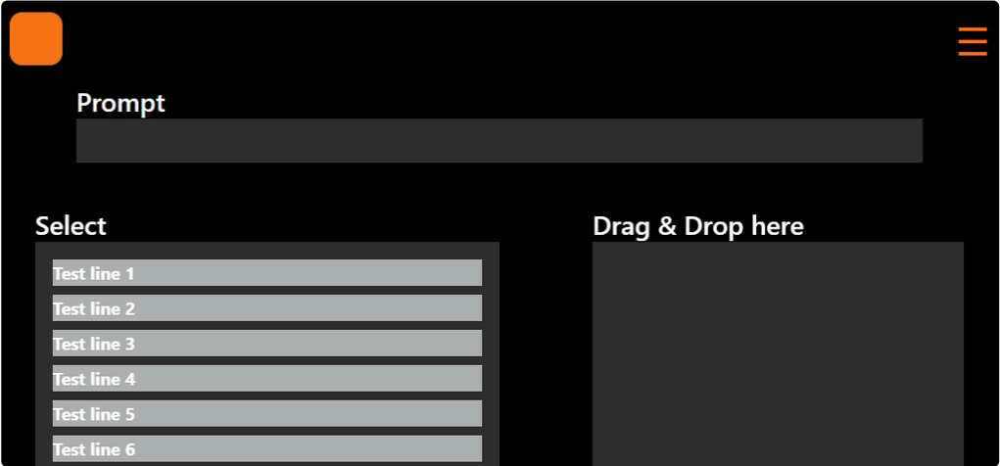
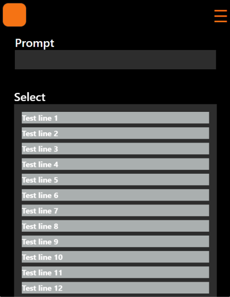
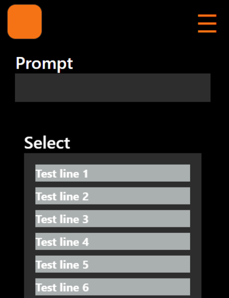
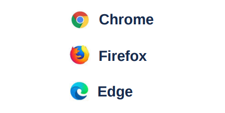
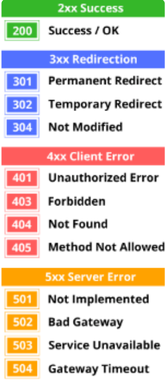
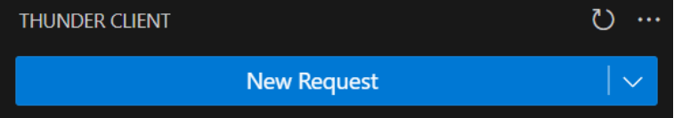
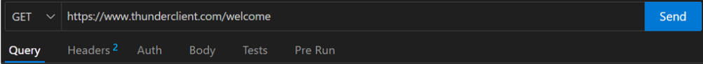
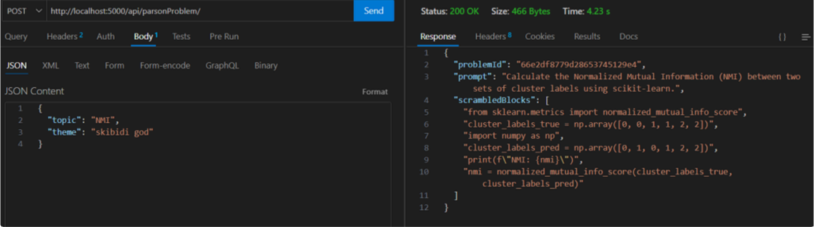
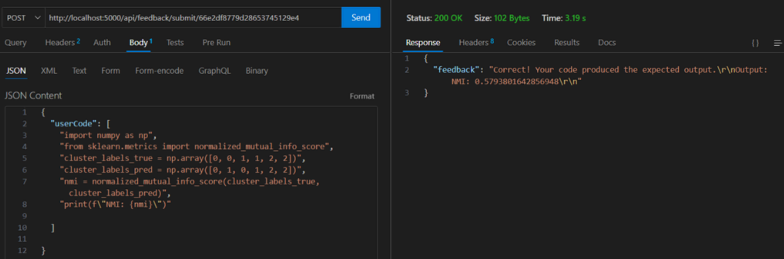

# Parsons Problems for Data Analytics

This repository contains the code for a web application that generates Parsons problems specifically for data analytics. Parsons problems are a type of educational puzzle where learners must rearrange given code blocks into the correct order to solve a problem. This application allows users to select from predetermined categories to tailor the problems to their learning needs.

## Features

- **Category Selection:** Users can choose from various data analytics categories to receive problems relevant to their interests.
- **Dynamic Problem Generation:** Problems are generated dynamically based on the selected category.
- **User-Friendly Interface:** The web app features an intuitive interface for easy navigation and use.
- **Feedback System:** Provides immediate feedback on the correctness of the arranged code blocks.

## Installation

To run this project locally, follow these steps:

1. Clone the repository:

   ```bash
   git clone https://github.com/yourusername/parsons-problems-data-analytics.git
   ```
2. Open two terminal instances one terminal will be used to run the server side, the other to run the front end client side part of the project. 
2. In both terminals navigate to COMP30022 directory

   ```bash
   cd COMP30022
   ```
3. In the first terminal navigate to /client/app
   do 
   ```
   cd client
   ```
   then 
   ```
   cd app
   ```
3. In the second terminal instance navigate to the backend part of the project

   ```bash
   cd server
   ```


4. In BOTH terminal instances, we need to install all dependencies this step is a must, so enter this command in both terminals:

   ```bash
   npm install
   ```

7. Now you need to install the python libraries. Open a third terminal instance and pip install the following libraries. If you do not have python or pip installed, but the setup for python and pip is outside the scope of this document, we assume that you have it installed already. 
```bash
flake8
scikit-learn
numpy
pandas
```
8. Now the relevant installation is complete, we need to know how to run the project so refer to [Project Setup](#project-setup)


# Project Setup and Testing Guide

## Table of Contents

- [Parsons Problems for Data Analytics](#parsons-problems-for-data-analytics)
  - [Features](#features)
  - [Installation](#installation)

- [Project Setup and Testing Guide](#project-setup-and-testing-guide)
  - [Project Setup](#project-setup)
  - [Running the Project](#running-the-project)
   - [Usage](#usage)
  - [Front End testing expectations](#front-end-testing-expectations)
    - [Front End testing methods](#front-end-testing-methods)
  - [Back End Testing Expectations](#back-end-testing-expectations)
    - [Backend testing methods](#backend-testing-methods)

## Project Setup

*** Disclaimer, this project relies on the use of local hosts ports 3000 and 3001. For trouble shooting network error code: 0, you must ensure that these two ports are freed at the time of running the front and backend of the project. 

This project uses the MERN stack. Follow these steps for the initial setup. The first few parts just reminds you of the installation process read it again just to ensure that you have done it correctly.

1. **Clone or fork the repository** from GitHub.
2. **Frontend Setup**:
   - Navigate to `client/app`.
   - Open the terminal in the `app` folder and run:
     ```bash
     npm install
     ```
   - This will install all frontend dependencies.
3. **Backend Setup**:
   - Navigate to the root directory, then go to `/server`, and run:
     ```bash
     npm install
     ```
4. **Python Libraries**:
   - Ensure the following Python libraries are installed with `pip install`:
     - `flake8`
     - `scikit-learn`
     - `numpy`
     - `pandas`
   - If Python is not installed, install it first.
5. **Environment File (.env)** :
   ****Disclaimer!!! this file is already configured for the assesors of the project the secret keys and tokens are given. However if one wants to utilise it for personal use then follow this step to configure a new .env file, otherwise skip this step. 

   - Create a `.env` file in the `/server` directory with the following structure:
     ```plaintext
     DATABASE_URI=
     PORT=
     AI_API_KEY=
     ACCESS_TOKEN_SECRET=''
     REFRESH_TOKEN_SECRET=''
     ```
   
   - Set up a MongoDB Atlas account, create a free cluster and collection, and generate a database key.
   - Copy the MongoDB Atlas URL into `DATABASE_URI`.
   - Specify an available port in the `PORT` variable.
6. **AI API Key**:
   - Create a Gemini AI account and generate an API key.
   - Place the AI key into the `AI_API_KEY` field in `.env`.

---

## Running the Project

To run the project, open two terminal instances:

- **Frontend**: Navigate to `client/app` and execute:
  ```bash
  npm run start
  ```
- **Backend**: Navigate to `/server` and execute:
  ```bash
  node index.js
  ```
## Usage

1. **Register an account** you need to register an account first before navigating around to different pages.
2. If you already registered then simple login with an existing username and password.
1. **Select a Category:** Choose a data analytics category from the dropdown menu and click a topic.
2. **Solve the Problem:** Now you should be in the workspace page where you can rearrange the code blocks to form the correct solution, you must drag all the code blocks before submitting. 
4. **Receive Feedback:** To submit Parsons Problems type : `python drag.py` into the bottom console on the workspace page and viola

** As per client request, there is a special admin route with an admin account. The original client for this project should have the authentication credentials for the admin account, and can test the admin account if they chose to do so. 

---

## Front End testing expectations

Expectations

1. Responsive test. Frequent checks must be made to ensure that pages remain responsive across different screen sizes.

Desktop viewport range: ~800 -1000 pixels:![alt text]



Tablet viewport range: ~500 -790 pixels:



Mobile viewport range: ~330 -490 pixels:



1. Interactive test. Every interactable component must support touch, and mouse events.
2. Browser test. Ensure that all pages and features are supported for the three major web-browsers repeat steps 1.) and 2.) for each browser.

   

### Front End testing methods

For front end testing use it is sufficient to use the developer tools provided by each major browsers being tested. See See [Front end testing methods](https://techballers.atlassian.net/wiki/spaces/Artefacts/pages/edit-v2/5046282#Front-end-testing-methods)\_ \_for frontend testing expectations.

**Example: Chrome dev tool**

[Chrome DevTools | Chrome for Developers](https://developer.chrome.com/docs/devtools)

1. `Responsive test`: Find the following navigation bar in the top left corner 
   Enter the viewport size range in the input boxes in pixel units.

2. `Interactive test`: Find the following navigation bar in the top right corner 
   Click the 2nd icon from the left to enable and disable touch events. When the icon is disabled, mouse events will be enabled and your mouse cursor will be visible.

## Back End Testing Expectations

**Expectations**

1. _Error codes and asserts_. It is expected that asserts and HTTP error codes are placed throughout backend code to ensure ease of debugging.

   

2. _Route and request test_. Routes should be
   tested for all HTTP request types placed
   onto the route.

### Backend testing methods

For back end expectations see [Backend testing methods](https://techballers.atlassian.net/wiki/spaces/Artefacts/pages/edit-v2/5046282#Backend-testing-methods)

1. Error codes and asserts:
   Error codes and assert statements should be self explanatory and implemented in the code itself.
2. Routes and request test
   **Example: Thunder Client**.
   The following tool will be used for testing, and tool support is on VS code.
   [Thunder Client - Rest API Client Extension for VS Code](https://www.thunderclient.com/)

After installing thunder client via VSCode extensions, navigate to the thunder icon on VSCode left sidebar.

1. On the top left, click New Request

   

2. Select the HTTP method type, enter the URL. Click “Body“ and enter test cases for the body of the request object.
   

3. The following are example tests
   
   
